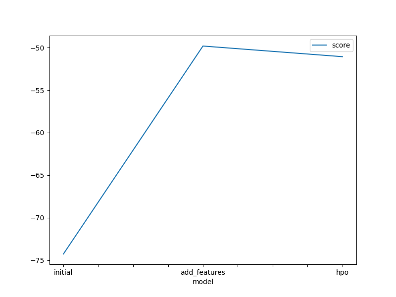
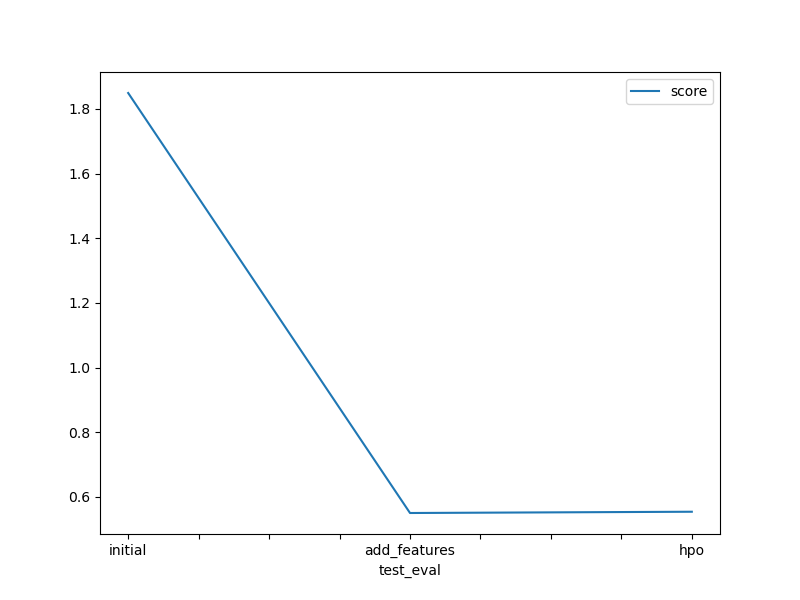

# Report: Predict Bike Sharing Demand with AutoGluon Solution
#### SHAIK MANSOOR ALI

## Initial Training
### What did you realize when you tried to submit your predictions? What changes were needed to the output of the predictor to submit your results?
Some of the experiments delivered negative results. Kaggle doesn't accept submissions with negative predictions hence replaced negative numbers with 0.

### What was the top ranked model that performed?
WeightedEnsemble_L3 is the top ranked model.

## Exploratory data analysis and feature creation
### What did the exploratory analysis find and how did you add additional features?
- Several features were extracted from `datetime` such as date, month, hour features.
- Initially the model automatically considered independent features `season`, `weather ` as integer datatype. Since they are categorical variables, they are transformed into `category` data type.
- Since the independent features `casual`, `independent` are missing from the test data, so they are dropped from the train data.     

### How much better did your model preform after adding additional features and why do you think that is?
After adding additional features there is increase in model score by 33%.

## Hyper parameter tuning
### How much better did your model preform after trying different hyper parameters?
The model performed almost closer to earlier iteration of the model.

### If you were given more time with this dataset, where do you think you would spend more time?
I would like to investigate potential outcomes when AutoGluon is run for an different periods with a high quality preset and different hyperparameter settings.

### Create a table with the models you ran, the hyperparameters modified, and the kaggle score.
|model|hpo1|hpo2|score|
|--|--|--|--|
|initial|default|default|1.84907|
|add_features|default|default|0.55044|
|hpo|num_boost_round = ag.space.Int(lower=100, upper=800, default=100), num_leaves = ag.space.Int(lower=26, upper=66, default=36), ag_args: name_suffix: XT|eval_metric: rmse, max_depth: ag.space.Int(lower=5, upper=8, default=6), n_estimators: ag.space.Int(lower=100,upper=500, default=100)|0.55434|

### Create a line plot showing the top model score for the three (or more) training runs during the project.

### Create a line plot showing the top kaggle score for the three (or more) prediction submissions during the project.

## Summary
TODO: Add your explanation
